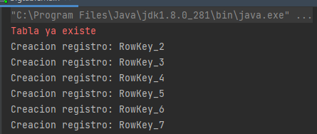

# BD2 Taller 4

##Clase BigTable y Weather
Se crea la clase para el manejo de la conexion, creación de la tabla y consulta para los archivos referentes a
"Generation_Data" para las plantas 1 y dos, la información de las dos plantas es guardada en la misma tabla, el campo
que realiza la diferencia de estas es "PLANT_ID".

Por motivos de pruebas primero se crea la tabla y despues se guarda la información generando el mensaje que la tabla ya
existe.

>Daniela Prado Chaparro